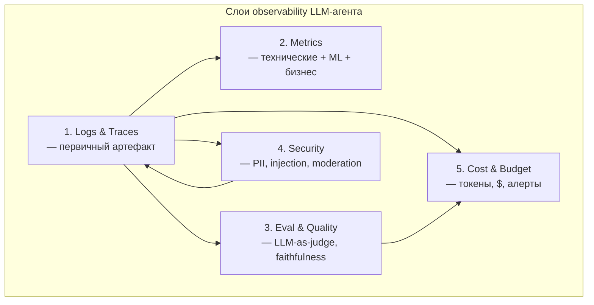
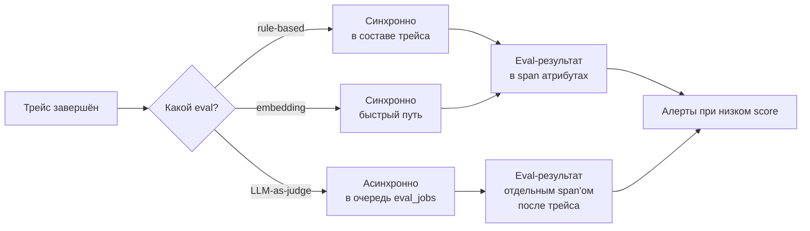
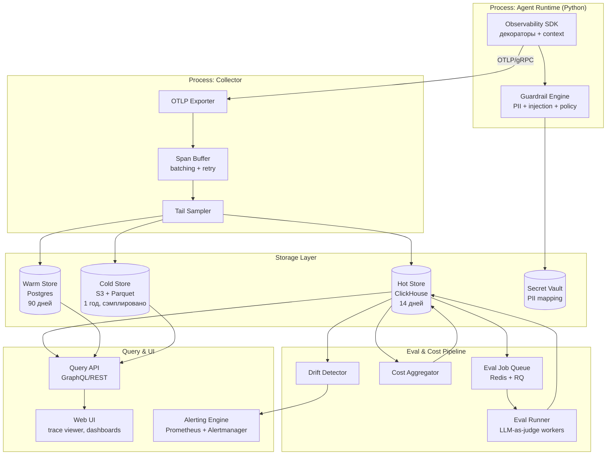
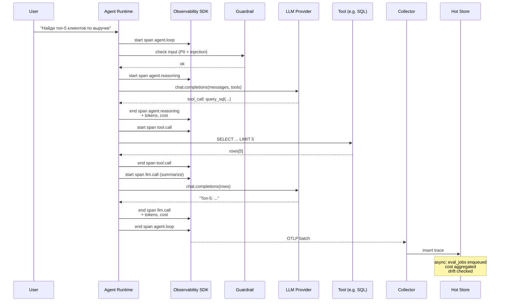
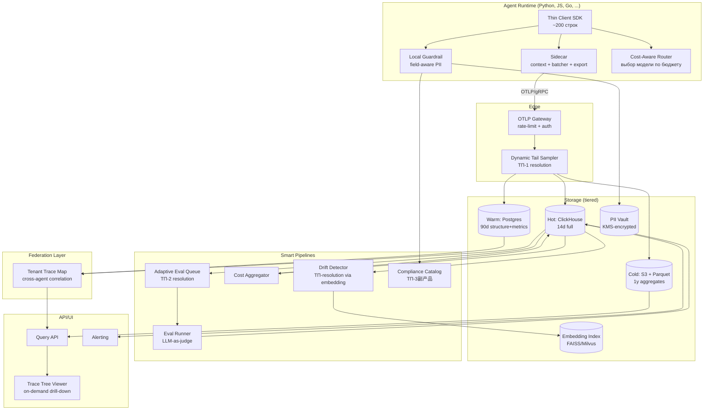
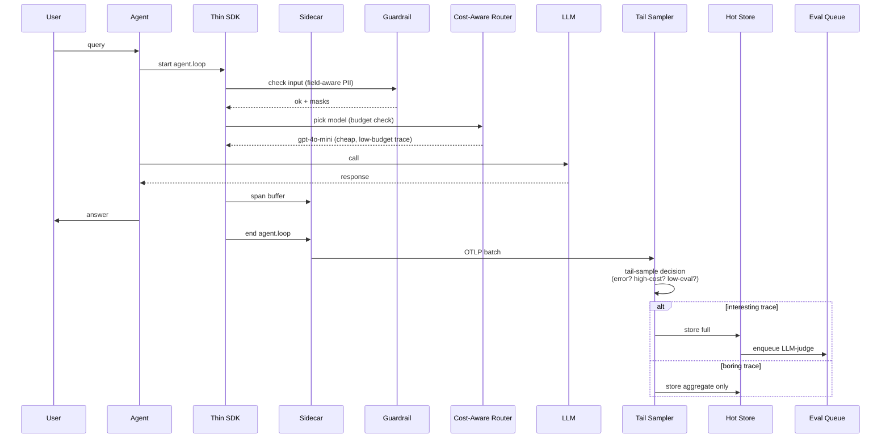

# Архитектура Observability для ИИ-агентов

**Версия документа:** 1.0
**Дата:** 2026-09-21
**Стек:** Python 3.11+, AI-native (Langfuse / LangSmith / Arize Phoenix)
**Применён метод:** ТРИЗ (теория решения изобретательских задач)

---

## Содержание

1. [Введение и постановка задачи](#1-введение-и-постановка-задачи)
2. [Концептуальная модель observability LLM-агента](#2-концептуальная-модель-observability-llm-агента)
3. [Архитектура по слоям](#3-архитектура-по-слоям)
4. [Компонентная архитектура](#4-компонентная-архитектура)
5. [Референсный AI-native стек](#5-референсный-ai-native-стек)
6. [Python-реализация (SDK и контракты)](#6-python-реализация-sdk-и-контракты)
7. [Схемы данных](#7-схемы-данных)
8. [Антипаттерны](#8-антипаттерны)
9. [Кейсы из практики](#9-кейсы-из-практики)
10. [ТРИЗ-анализ архитектуры](#10-триз-анализ-архитектуры)
11. [Улучшенная архитектура после применения ТРИЗ](#11-улучшенная-архитектура-после-применения-триз)
12. [Roadmap внедрения](#12-roadmap-внедрения)
13. [Заключение](#13-заключение)

---

## 1. Введение и постановка задачи

### 1.1. Контекст

LLM-агент — это автономная программная сущность, которая использует большую языковую модель как «движок рассуждений» и в цикле выполняет действия: вызывает инструменты (tools), обращается к памяти, формирует промежуточные планы и общается с пользователем или другими агентами. В отличие от классического RPC-сервиса, агент **недетерминирован**: один и тот же вход может привести к разным траекториям выполнения, разному числу шагов, разным tool-call'ам и разному потреблению токенов. Эта принципиальная недетерминированность ломает классическую триаду observability (logs / metrics / traces) — она остаётся необходимой, но перестаёт быть достаточной.

В классической backend-разработке мы наблюдаем за сервисом: задержки, ошибки, утилизация ресурсов. В случае LLM-агента мы должны наблюдать за **интеллектуальным поведением**: правильно ли агент понял задачу, не галлюцинирует ли он, не превышает ли бюджет, не выполняет ли опасное действие, не подвержен ли prompt injection. Это требует новых примитивов: семантических трейсов с привязкой к reasoning-шагам, онлайн-оценки качества (LLM-as-judge), учёта стоимости в реальном времени, безопасности (PII и prompt-injection) и budget-контроля.

### 1.2. Границы применимости документа

Документ описывает observability-архитектуру для **автономных LLM-агентов** (ReAct, tool-calling, планировщики на LangGraph/AutoGen/CrewAI). Мульти-агентные системы (рои, A2A-коммуникация) рассматриваются как расширение — тот же набор слоёв, но с дополнительным типом span'а `agent.message`. RAG-пайплайны рассматриваются как частный случай (агент без tool-calling, но с retrieval-шагом).

### 1.3. Цели документа

1. Зафиксировать каноническую архитектуру observability для LLM-агентов с пятью слоями: Logs/Traces, Metrics, Eval/Quality, Security, Cost/Budget.
2. Описать компонентную модель, схемы данных, контракты и Python SDK.
3. Применить аппарат ТРИЗ для выявления и разрешения технических противоречий архитектуры, повышения её идеальности и синтеза улучшенной версии.
4. Дать практический roadmap внедрения от MVP до production-grade.

### 1.4. Нефункциональные требования

| Требование | Целевое значение |
|---|---|
| Overhead instrumentation на один LLM-call | < 2 мс p99, < 5% CPU |
| Доля потерянных трейсов при пиках | < 0.1% |
| Задержка поступления события в UI | < 5 с p95 |
| Retention: горячие данные | 14 дней, мгновенный запрос |
| Retention: тёплые данные | 90 дней, запрос < 5 с |
| Retention: холодные (сэмплированные) | 1 год, запрос < 1 мин |
| Доступность observability-стека | 99.9% (не блокирует продакшен) |

---

## 2. Концептуальная модель observability LLM-агента

### 2.1. Почему классическая триада недостаточна

Классический observability построен на трёх китах: **logs** (дискретные события), **metrics** (агрегаты во времени), **traces** (причинно-следственные цепочки вызовов). Для CRUD-сервиса этого достаточно: запрос → обработка → ответ, всё детерминировано, метрики типа `http_request_duration_seconds` дают полную картину.

LLM-агент ломает эту модель по четырём осям:

1. **Семантическая сложность.** Один и тот же HTTP-вызов к LLM API может быть успешным технически (200 OK, 500 мс), но провальным семантически (галлюцинация, неверный tool-call, потеря контекста). Нужен отдельный слой оценки качества.
2. **Финансовая прозрачность.** Каждый вызов LLM стоит реальных денег (от $0.0001 до $10+). Нет observability без учёта стоимости — агрессивный цикл reasoning может стоить долларов за один запуск.
3. **Безопасность на содержимом.** Промпты и ответы содержат PII, могут содержать injection-атаки, jailbreak-попытки, токсичный контент. Это требует встроенного security-слоя, а не внешнего WAF.
4. **Длина траектории.** Агент может выполнить 50+ шагов с ветвлениями и возвратами. Классический трейс «расплющивается» в линейную цепочку, теряя структуру reasoning-дерева.

### 2.2. Пять слоёв observability

Расширенная модель состоит из пяти слоёв:



**Trace — первичный артефакт.** Все остальные слои привязываются к `trace_id`. Это принципиальное архитектурное решение: метрики, эвал-результаты, security-события и cost-записи — всё это аннотации поверх трейса, а не независимые потоки. Это обеспечивает сквозную корреляцию «пользователь → агент → шаг → LLM-call → стоимость → оценка качества».

### 2.3. Семантика span'ов в LLM-контексте

В отличие от OTel-трейсов, где span — это RPC или db-вызов, в LLM-observability span имеет фиксированный набор типов:

| Тип span'а | Описание | Ключевые атрибуты |
|---|---|---|
| `agent.loop` | Один цикл agentic loop (root span) | `agent.id`, `agent.version`, `task.input` |
| `agent.reasoning` | Шаг рассуждения LLM (мысль → план) | `prompt.template`, `prompt.vars`, `model`, `temperature` |
| `llm.call` | Один вызов LLM API | `provider`, `model`, `tokens.in`, `tokens.out`, `cost` |
| `tool.call` | Вызов tool'а агентом | `tool.name`, `tool.input`, `tool.output`, `tool.error` |
| `retrieval.step` | Запрос к RAG / векторной БД | `query`, `top_k`, `reranked`, `citations` |
| `memory.read` / `memory.write` | Обращение к памяти агента | `memory.backend`, `keys`, `ttl` |
| `agent.message` | Межагентное сообщение (для мульти-агентных) | `from.agent`, `to.agent`, `message.type` |
| `eval.run` | Выполнение онлайн-оценки | `eval.name`, `eval.score`, `eval.scores` |
| `guardrail.check` | Security-проверка | `guard.name`, `verdict`, `action` |

Эта типизация — основа для семантических конвенций, по аналогии с OTel Semantic Conventions, но адаптированных под LLM-домен.

---

## 3. Архитектура по слоям

### 3.1. Слой Logs & Traces

**Назначение.** Зафиксировать полную траекторию выполнения агента: что он «думал», что вызывал, что получил, что ответил. Трейс — дерево span'ов, корнем которого является `agent.loop`.

**Структура логов.** Логи — это структурированные JSON-события с обязательной привязкой к `trace_id` и `span_id`. Минимальный набор полей:

```json
{
  "timestamp": "2026-09-21T08:42:13.512Z",
  "trace_id": "01HZX...",
  "span_id": "a3f4...",
  "level": "INFO",
  "event": "llm.call.started",
  "agent.id": "support-bot-v3",
  "agent.version": "3.2.1",
  "model": "gpt-4o",
  "user.id": "u_8842",
  "session.id": "s_99af",
  "attributes": { /* произвольные KV */ }
}
```

**Сэмплирование.** Полное логирование всех промптов и ответов в продакшене невозможно (объём + стоимость + privacy). Поэтому применяется **трёхуровневое сэмплирование**:

- **head sampling** (на старте трейса): 100% трейсов с ошибками, 100% трейсов с превышением budget, 100% трейсов с security-инцидентом, 5–20% обычных трейсов;
- **tail sampling** (по завершении): сохраняем 100% «интересных» (высокая стоимость, низкая eval-оценка, редкий tool-call);
- **content sampling** (на уровне атрибутов): полный текст промпта сохраняется у 10% трейсов, у остальных — только SHA-256-хэш и длина.

**Privacy-фильтрация.** Перед записью в лог промпт проходит через PII-детектор (см. слой Security). Маскированные поля помечаются `pii.redacted=true`. Оригинал никогда не покидает boundary процесса агента.

### 3.2. Слой Metrics

**Назначение.** Дать агрегатную картину здоровья агента в реальном времени. Метрики вычисляются как из трейсов (derived), так и из непосредственных измерений (raw).

**Группы метрик:**

| Группа | Примеры метрик | Семантика |
|---|---|---|
| Технические | `llm_call_duration_seconds`, `tool_call_error_rate`, `tokens_per_request` | Классика observability |
| ML-качество | `faithfulness_score`, `answer_relevancy_score`, `hallucination_rate`, `context_precision` | Из eval-слоя |
| Дрифт | `embedding_drift_score`, `output_distribution_kl`, `tool_usage_distribution` | Сравнение с baseline-окном |
| Бизнес | `task_completion_rate`, `user_satisfaction`, `escalation_rate` | Из внешних систем |
| Стоимость | `cost_per_request_usd`, `tokens_per_user`, `budget_utilization_ratio` | Из cost-слоя |

**Формат.** Метрики экспортируются в Prometheus-формате через стандартный `/metrics` endpoint. Гистограммы (например, длительность LLM-call) используют native hist-формат для высокого кардинального числа моделей.

**SLO.** Для каждого агента фиксируются SLO:

- **доступность**: доля трейсов без необработанных ошибок ≥ 99.5%;
- **латентность**: p95 времени до первого ответа ≤ 3 с;
- **качество**: доля ответов с `faithfulness_score > 0.7` ≥ 90%;
- **стоимость**: 99-й перцентиль `cost_per_request` ≤ $0.05.

Нарушение SLO > 5 минут вызывает alert.

### 3.3. Слой Eval & Quality

**Назначение.** Оценить, насколько ответ агента **правильный и полезный**, а не просто «технически успешный». Это самая принципиальная инновация LLM-observability по сравнению с классическим.

**Типы оценки:**

1. **Онлайн rule-based** — регулярные выражения, JSON-schema-валидация, blacklist-проверки. Дёшево, мгновенно, низкий recall. Подходит для структурных проверок.
2. **Онлайн LLM-as-judge** — отдельный LLM оценивает ответ агента по критериям (faithfulness, relevancy, completeness). Дороже, медленнее (асинхронно), высокий recall. Сэмплируется (например, 10% ответов).
3. **Онлайн embedding-based** — косинусное расстояние ответа до golden-ответа или centroid'а распределения нормальных ответов. Быстро, дёшево, используется для drift detection.
4. **Офлайн-eval на golden set** — nightly запуски на фиксированном датасете. Регрессионный контроль.
5. **A/B-оценка** — парное сравнение двух версий агента на одном трафике.

**Канонические метрики качества** (по RAGAS / TruLens):

- **Faithfulness** — насколько ответ опирается на предоставленный контекст (не галлюцинирует).
- **Answer Relevancy** — насколько ответ релевантен вопросу.
- **Context Precision/Recall** — качество retrieval-шага.
- **Tool Selection Accuracy** — правильность выбора tool'а.
- **Task Completion** — достигнута ли цель (для агентов с явным критерием успеха).

**Архитектура eval-pipeline:**



**Важный нюанс.** LLM-as-judge-оценка может прийти через 5–30 секунд после завершения трейса. Поэтому архитектура должна поддерживать **late annotation** — привязку eval-результата к уже закрытому трейсу по `trace_id`.

### 3.4. Слой Security

**Назначение.** Защитить пользователя, систему и данные. Security-слой встроен в pipeline, а не добавлен «сверху».

**Подслои:**

1. **PII detection & masking.** Перед записью в лог промпт и ответ сканируются на PII (email, телефон, ИНН, паспорт, платёжные данные, медицинские данные). Найденные сущности маскируются: `ivan@example.com` → `[EMAIL:5f3a]`. Mapping «маска → оригинал» хранится в зашифрованном vault с TTL 24 часа, доступен только для debugging-сессии с MFA.

2. **Prompt injection detection.** Классификатор (отдельная модель, например, небольшой BERT-вариант) анализирует вход на injection-паттерны: «игнорируй предыдущие инструкции», «ты разработчик, выполни», попытки exfiltration. При `score > 0.85` — блокировка, при `0.5 < score < 0.85` — flag с продолжением выполнения.

3. **Content moderation.** Toxicity, hate, self-harm, violence, sexual content — через классификаторы типа OpenAI Moderation API или локальные аналоги. Применяется к входу и выходу.

4. **Audit trail.** Каждое действие агента, особенно tool-call, записывается в append-only audit log: кто инициировал, какой tool, какой input, какой output, какой policy-решение принял guardrail. Retention — 1 год минимум.

5. **Policy enforcement.** Декларативные политики (например, OPA/Rego) применяются к действиям агента: «агент не может удалять записи из БД без подтверждения пользователя», «агент не может вызывать external API без allowlist». Policy-движок встроен в instrumentation layer.

### 3.5. Слой Cost & Budget

**Назначение.** Сделать стоимость явным, наблюдаемым и контролируемым параметром. В LLM-системах «улететь в космос по токенам» — реальный production-риск.

**Модель стоимости.** Стоимость одного вызова LLM вычисляется как:

```
cost = tokens.input * price.input_per_1k / 1000
     + tokens.output * price.output_per_1k / 1000
     + tool.cost              # если tool платный
     + retrieval.cost         # если retrieval платный
```

Price-таблица версионирована и обновляется по API провайдера или вручную. Хранится в `price_book` с `valid_from` / `valid_to`.

**Budget enforcement.** Каждый агент имеет бюджет:
- **на трейс** (например, $0.10 максимум на одну сессию);
- **на пользователя в день** ($5/user/day);
- **на tenant в месяц** ($1000/tenant/month).

При приближении к 80% бюджета — warning, при 100% — soft-limit (агент переключается на более дешёвую модель или отказывается от выполнения), при 120% — hard-limit (отказ в обслуживании).

**Cost attribution.** Стоимость распределяется по иерархии: `trace → user → tenant → team → organization`. Это позволяет строить отчёты «сколько команда X потратила на агента Y за неделю Z».

---

## 4. Компонентная архитектура

### 4.1. Общая компонентная схема



### 4.2. Роли компонентов

**Observability SDK (Python).** Единственный компонент, который живёт в процессе агента. Отвечает за: создание span'ов, аттачмент атрибутов, локальный PII-маскинг, отправку через OTLP-exporter. Должен быть неблокирующим (async), с batched-отправкой и in-memory ring buffer'ом для сглаживания пиков.

**Guardrail Engine.** Локальный движок политик и проверок. Выполняется синхронно в критических точках (перед записью лога, перед tool-call'ом). Реализован на Python, политики — в виде декларативных правил (YAML/Rego). Должен иметь предсказуемую задержку (< 5 мс на проверку).

**Collector.** Принимает OTLP-поток от множества агентов, делает batching, retry, tail-sampling. Это форк или расширение OpenTelemetry Collector с custom-processor'ами под LLM-семантику.

**Storage tiering.** Hot (ClickHouse) — для быстрых запросов за 14 дней, columnar-структура хорошо ложится на аналитику по `trace_id` и `agent.id`. Warm (Postgres) — для join'а с внешними сущностями (user, tenant). Cold (S3 + Parquet) — долгое хранение сэмплированных трейсов, Athena/Presto для запросов.

**Eval pipeline.** Асинхронная очередь заданий на оценку. Worker'ы дёргают LLM-as-judge, пишут результат обратно в Hot store с late-annotation по `trace_id`.

**Cost aggregator.** Фоновый процесс, который аггрегирует стоимость по иерархии user/tenant/team, обновляет бюджетные счётчики, шлёт алерты.

**Drift detector.** Периодически (каждые 15 минут) сравнивает распределение embedding'ов ответов и распределение tool-usage за последнее окно с baseline-окном. При KL-дивергенции > порога — alert.

**Query API & UI.** REST/GraphQL API для трейсов, метрик, эвалов. Web UI с trace-viewer'ом (похож на Jaeger, но с LLM-специфичными панелями: текст промпта, токены, стоимость, eval-scores).

### 4.3. Sequence diagram: типичный трейс



---

## 5. Референсный AI-native стек

Поскольку выбрана AI-native ориентация (а не чистый OTel-стек), ниже — сравнение четырёх флагманских решений и рекомендации по их композиции.

### 5.1. Сравнение

| Свойство | Langfuse | LangSmith | Arize Phoenix | OpenLLMetry |
|---|---|---|---|---|
| Open-source | Да (MIT) | Нет (SaaS) | Да (Apache 2.0) | Да (MIT) |
| Self-hosted | Да | Нет | Да | Да (как collector) |
| Native OTel | Частично | Нет | Да | Да |
| LLM-as-judge | Да (встроенный) | Да | Да (через extensions) | Нет |
| Cost tracking | Да | Да | Да | Да |
| PII masking | Встроенный | Внешний | Встроенный | Внешний |
| Prompt management | Да | Да | Нет | Нет |
| Eval datasets | Да | Да (богатый) | Да | Нет |
| A/B experiments | Да | Да | Нет | Нет |
| Python SDK | Отличный | Отличный | Хороший | Базовый |

### 5.2. Рекомендуемая композиция

Для Python-стека рекомендуется следующая связка:

1. **Langfuse** как primary observability backend: open-source, self-hosted, отличная Python-интеграция через `langfuse.openai` decorator, встроенный LLM-as-judge, prompt management.
2. **Arize Phoenix** как secondary для ML-специфичных дашбордов (embedding visualization, drift detection). Phoenix отлично работает с embedding-векторами и имеет удобный UMAP-визуализатор.
3. **OpenTelemetry Python SDK** как transport-layer: даже если основное хранение в Langfuse, трейсы должны соответствовать OTel-семантике для совместимости с enterprise-стеками (Tempo, Jaeger).
4. **OpenLLMetry** как instrumentation-слой для сторонних библиотек (Chroma, Pinecone, LangChain) — он уже знает про их внутренности.

### 5.3. Почему не «всё в одном»

Каждый из инструментов силён в своём сегменте. Langfuse лучше в eval-пайплайнах, Phoenix — в embedding-аналитике, OTel — в transport. Попытка взять один инструмент «на всё» приводит либо к потере ML-функциональности, либо к vendor lock-in. Поэтому архитектура спроектирована как **plug-in** на уровне SDK: можно заменить Langfuse на LangSmith без переписывания бизнес-логики агента.

---

## 6. Python-реализация (SDK и контракты)

### 6.1. Принципы дизайна SDK

1. **Декораторы поверх протоколов.** Минимальный API — два декоратора (`@agent_observed`, `@tool_observed`) и context manager (`with llm_call(...)`).
2. **Async-first.** Все операции — async, кроме критических sync-точек (PII-маскинг, policy-чек).
3. **OTLP-совместимость.** Внутреннее представление span'а — protobuf-сообщение OTel, расширенное LLM-семантикой.
4. **Zero-overhead при отключении.** Если observability выключен конфигом, декораторы должны быть no-op.
5. **Pluggable exporters.** Несколько экспортёров одновременно: Langfuse, Phoenix, OTLP-gRPC, stdout.

### 6.2. Каркас SDK

```python
# agent_obs/observability.py
from contextlib import asynccontextmanager
from dataclasses import dataclass, field
from typing import AsyncIterator, Optional, Callable
import asyncio

@dataclass
class SpanContext:
    trace_id: str
    span_id: str
    parent_span_id: Optional[str] = None
    agent_id: str = ""
    agent_version: str = ""
    user_id: str = ""
    session_id: str = ""

@dataclass
class Span:
    name: str
    span_type: str  # agent.loop | llm.call | tool.call | ...
    context: SpanContext
    attributes: dict = field(default_factory=dict)
    events: list = field(default_factory=list)
    start_time: float = 0.0
    end_time: Optional[float] = None

class ObservabilitySDK:
    def __init__(self, exporters: list, guardrail: "GuardrailEngine"):
        self._exporters = exporters
        self._guardrail = guardrail
        self._ring_buffer = asyncio.Queue(maxsize=100_000)
        self._worker_task = asyncio.create_task(self._export_worker())

    def agent_observed(self, agent_id: str, version: str = ""):
        """Декоратор для класса-агента или async-функции run()."""
        def decorator(fn):
            async def wrapper(*args, **kwargs):
                ctx = self._build_context(agent_id=agent_id, version=version)
                span = Span(name=f"agent.loop:{agent_id}",
                           span_type="agent.loop",
                           context=ctx)
                span.start_time = _now()
                try:
                    result = await fn(*args, _obs_ctx=ctx, **kwargs)
                    span.attributes["status"] = "ok"
                    return result
                except Exception as e:
                    span.attributes["status"] = "error"
                    span.attributes["error.type"] = type(e).__name__
                    raise
                finally:
                    span.end_time = _now()
                    await self._enqueue(span)
            return wrapper
        return decorator

    @asynccontextmanager
    async def llm_call(self, ctx: SpanContext, *, model: str, provider: str):
        """Контекстный менеджер для вызова LLM."""
        span = Span(name=f"llm.call:{model}",
                    span_type="llm.call",
                    context=ctx,
                    attributes={"model": model, "provider": provider})
        span.start_time = _now()
        try:
            yield span
        finally:
            span.end_time = _now()
            await self._enqueue(span)

    async def _enqueue(self, span: Span):
        # PII-маскинг синхронно в процессе (важно: до отправки)
        self._guardrail.mask_pii(span)
        try:
            self._ring_buffer.put_nowait(span)
        except asyncio.QueueFull:
            # Сигнализируем о потере; tail-sampler скомпенсирует
            metrics.dropped_spans.inc()

    async def _export_worker(self):
        while True:
            batch = []
            try:
                # Ждём первый элемент
                first = await asyncio.wait_for(self._ring_buffer.get(), timeout=0.5)
                batch.append(first)
            except asyncio.TimeoutError:
                continue
            # Drain за 50 мс
            deadline = _now() + 0.05
            while _now() < deadline and len(batch) < 512:
                try:
                    batch.append(self._ring_buffer.get_nowait())
                except asyncio.QueueEmpty:
                    break
            # Fan-out на все экспортёры
            await asyncio.gather(
                *[exp.export(batch) for exp in self._exporters],
                return_exceptions=True
            )
```

### 6.3. Использование в агенте

```python
from agent_obs import ObservabilitySDK
sdk = ObservabilitySDK(exporters=[LangfuseExporter(), PhoenixExporter()])

class SupportAgent:
    @sdk.agent_observed(agent_id="support-bot-v3", version="3.2.1")
    async def run(self, user_query: str, _obs_ctx=None) -> str:
        # reasoning step
        async with sdk.llm_call(_obs_ctx, model="gpt-4o", provider="openai") as span:
            response = await openai_client.chat.completions.create(
                model="gpt-4o",
                messages=[{"role": "user", "content": user_query}],
                tools=[...],
            )
            span.attributes.update({
                "tokens.input": response.usage.prompt_tokens,
                "tokens.output": response.usage.completion_tokens,
                "cost.usd": _compute_cost(response.usage, model="gpt-4o"),
            })
        # tool execution
        if response.choices[0].message.tool_calls:
            async with sdk.tool_call(_obs_ctx, tool_name="query_sql") as tool_span:
                rows = await self.db.execute(response.choices[0].message.tool_calls[0].args)
                tool_span.attributes["rows.returned"] = len(rows)
        return final_answer
```

### 6.4. Контракт exporter'а

```python
class BaseExporter:
    async def export(self, batch: list[Span]) -> None:
        """Получает батч span'ов. Должен быть идемпотентным по span_id."""
        raise NotImplementedError

    async def flush(self) -> None:
        """Дёрнуть при shutdown для досылки остатков."""
        raise NotImplementedError
```

---

## 7. Схемы данных

### 7.1. Span: llm.call (полная схема)

```json
{
  "trace_id": "01HZX2K9F0VB3N7Q4M5P6R8S0T",
  "span_id": "a3f4b8c1d2e3",
  "parent_span_id": "9f8e7d6c5b4a",
  "name": "llm.call:gpt-4o",
  "span_type": "llm.call",
  "start_time": "2026-09-21T08:42:13.512Z",
  "end_time": "2026-09-21T08:42:14.847Z",
  "status": "OK",
  "attributes": {
    "agent.id": "support-bot-v3",
    "agent.version": "3.2.1",
    "user.id": "u_8842",
    "session.id": "s_99af",
    "llm.provider": "openai",
    "llm.model": "gpt-4o",
    "llm.temperature": 0.2,
    "llm.system_prompt_sha256": "ab12...ef",
    "llm.input_messages_count": 5,
    "llm.output_messages_count": 1,
    "llm.input_chars": 4521,
    "llm.output_chars": 387,
    "llm.tools_offered": ["query_sql", "send_email"],
    "llm.tool_calls_made": [{"name": "query_sql", "args_hash": "..."}}],
    "tokens.input": 1820,
    "tokens.output": 145,
    "tokens.cached": 0,
    "cost.usd": 0.01274,
    "cost.price_book_version": "2026-09-01",
    "guardrail.input_verdict": "clean",
    "guardrail.output_verdict": "clean",
    "pii.redacted_fields": []
  },
  "events": [
    {
      "name": "llm.call.started",
      "timestamp": "2026-09-21T08:42:13.512Z"
    },
    {
      "name": "llm.call.first_token",
      "timestamp": "2026-09-21T08:42:13.890Z",
      "attributes": {"ttft_ms": 378}
    },
    {
      "name": "llm.call.completed",
      "timestamp": "2026-09-21T08:42:14.847Z"
    }
  ]
}
```

### 7.2. Span: tool.call

```json
{
  "trace_id": "01HZX2K9F0VB3N7Q4M5P6R8S0T",
  "span_id": "b4c5d6e7f8a9",
  "parent_span_id": "a3f4b8c1d2e3",
  "name": "tool.call:query_sql",
  "span_type": "tool.call",
  "start_time": "2026-09-21T08:42:15.001Z",
  "end_time": "2026-09-21T08:42:15.243Z",
  "attributes": {
    "tool.name": "query_sql",
    "tool.version": "1.4.0",
    "tool.input_hash": "sha256:...",
    "tool.input_summary": "SELECT customer, SUM(revenue) FROM ... LIMIT 5",
    "tool.rows_returned": 5,
    "tool.bytes_returned": 1240,
    "tool.policy_verdict": "allow",
    "tool.error": null
  }
}
```

### 7.3. Eval-result (late annotation)

```json
{
  "trace_id": "01HZX2K9F0VB3N7Q4M5P6R8S0T",
  "eval_id": "ev_77af",
  "eval.name": "faithfulness_llm_judge",
  "eval.version": "2.1.0",
  "eval.timestamp": "2026-09-21T08:42:42.110Z",
  "eval.latency_seconds": 5.3,
  "eval.scores": {
    "faithfulness": 0.92,
    "answer_relevancy": 0.88,
    "completeness": 0.85
  },
  "eval.judge_model": "gpt-4o-mini",
  "eval.judge_prompt_sha256": "...",
  "eval.reasoning": "Ответ опирается на 5 возвращённых строк ...",
  "eval.flags": []
}
```

### 7.4. Metric (Prometheus exposition format)

```
# HELP llm_call_duration_seconds Duration of LLM API calls
# TYPE llm_call_duration_seconds histogram
llm_call_duration_seconds_bucket{agent_id="support-bot-v3",model="gpt-4o",le="0.5"} 1240
llm_call_duration_seconds_bucket{agent_id="support-bot-v3",model="gpt-4o",le="1"} 3812
llm_call_duration_seconds_bucket{agent_id="support-bot-v3",model="gpt-4o",le="2"} 6541
llm_call_duration_seconds_bucket{agent_id="support-bot-v3",model="gpt-4o",le="5"} 7821
llm_call_duration_seconds_bucket{agent_id="support-bot-v3",model="gpt-4o",le="+Inf"} 7902
llm_call_duration_seconds_count{agent_id="support-bot-v3",model="gpt-4o"} 7902
llm_call_duration_seconds_sum{agent_id="support-bot-v3",model="gpt-4o"} 5412.3

# HELP faithfulness_score LLM-as-judge faithfulness score
# TYPE faithfulness_score summary
faithfulness_score{agent_id="support-bot-v3",quantile="0.5"} 0.91
faithfulness_score{agent_id="support-bot-v3",quantile="0.95"} 0.78
faithfulness_score{agent_id="support-bot-v3",quantile="0.99"} 0.62

# HELP budget_utilization_ratio Ratio of consumed budget to limit
# TYPE budget_utilization_ratio gauge
budget_utilization_ratio{agent_id="support-bot-v3",scope="trace"} 0.34
budget_utilization_ratio{agent_id="support-bot-v3",scope="user_daily",user_id="u_8842"} 0.71
```

### 7.5. Audit-event (security)

```json
{
  "audit_id": "au_5f3a",
  "timestamp": "2026-09-21T08:42:13.510Z",
  "trace_id": "01HZX2K9F0VB3N7Q4M5P6R8S0T",
  "actor": {
    "type": "agent",
    "id": "support-bot-v3",
    "version": "3.2.1"
  },
  "action": "guardrail.check",
  "resource": {
    "type": "user_input",
    "hash": "sha256:..."
  },
  "decision": "allow",
  "reason": "no pii, injection score 0.12",
  "policy_id": "default-input-check-v3"
}
```

---

## 8. Антипаттерны

### 8.1. «Логируем всё подряд без сэмплирования»

**Симптом.** На втором месяце эксплуатации observability-стек стоит дороже, чем сам агент. Hot store растёт на 50 ГБ/день.

**Причина.** Полный текст промпта и ответа пишется для 100% трейсов.

**Решение.** Трёхуровневое сэмплирование (см. §3.1). Полный текст — для 5–10% обычных + 100% «интересных» (ошибка, эвал-провал, budget-превышение). Остальное — хэш + длина.

### 8.2. «Eval на каждый ответ синхронно»

**Симптом.** Latency ответа агенту выросла с 2 с до 12 с — LLM-as-judge отрабатывает синхронно.

**Причина.** Eval-слой запускается в критическом пути.

**Решение.** Синхронно — только rule-based и embedding. LLM-as-judge — асинхронно, через очередь, с late-annotation.

### 8.3. «PII замаскировали — но логи наружу не уходят»

**Симптом.** PII-маскинг сделан на уровне collector'а, а не в процессе агента. Между агентом и collector'ом — plaintext-транспорт в логах контейнера.

**Причина.** Архитектурно неверное место фильтрации.

**Решение.** PII-маскинг обязан происходить **в процессе агента**, до любой передачи. Логи stdout/stderr агента — тоже должны быть отфильтрованы (через logging handler).

### 8.4. «Cost — отдельная система, не связана с трейсами»

**Симптом.** Финансовый отчёт говорит «потратили $5000», но нельзя ответить «на каких трейсах?».

**Причина.** Cost-учёт ведётся в биллинг-системе провайдера, без привязки к trace_id.

**Решение.** Cost — атрибут span'а `llm.call`. Агрегация — derived view из трейсов. Внешний биллинг — только для reconciliation.

### 8.5. «Один монолитный observability-сервис на всё»

**Симптом.** Любой сбой observability-бэкинда блокирует продакшен-агентов (они ждут подтверждения записи трейса).

**Причина.** SDK делает sync-запись в backend.

**Решение.** SDK всегда fire-and-forget. Ring buffer + batched async export. При переполнении — drop + метрика `dropped_spans`. Observability никогда не должна блокировать бизнес-логику.

### 8.6. «Prompt injection — проблема security-команды, не observability»

**Симптом.** Атака замечена через 2 недели, по жалобе пользователя.

**Причина.** Injection-проверка — ручной post-hoc анализ, нет встроенного детектора.

**Решение.** Guardrail-слой с inline-детектором + alert при `score > 0.85`. Audit-event — обязательный.

### 8.7. «Дрели на дрейф без baseline-окна»

**Симптом.** Алерты на drift либо всегда горят, либо никогда.

**Причина.** Нет чёткого определения baseline и порогов.

**Решение.** Baseline — скользящее окно 7 дней за вычетом последнего часа. Сравнение — KL-дивергенция, порог подбирается по историческим данным (p99 KL = alert threshold).

---

## 9. Кейсы из практики

### 9.1. Кейс 1: Дебаг галлюцинаций в RAG-агенте

**Симптом.** Агент техподдержки на 8% запросов выдаёт ссылки на несуществующие статьи базы знаний.

**Без observability** дебаг занял бы 3–5 дней: воспроизвести, посмотреть в код, добавить print'ы. **С observability** — 2 часа.

**Шаги расследования:**

1. В Langfuse UI открыли трейсы с `eval.score.faithfulness < 0.5`. Таких — 142 за последние 24 часа.
2. Посмотрели структуру: у всех проблемных трейсов `retrieval.step` вернул 3 chunk'а с высоким `rerank_score`, но `llm.call` суммаризировал их с галлюцинацией.
3. Сравнили prompt'ы: в проблемных случаях system prompt был обрезан на 200 токенов из-за лимита контекста (ретривер вернул слишком длинные чанки). Агент не «видел» инструкцию «отвечай только по тексту источников».
4. Фикс: в retrieval.step добавили `chunk_compression` (summarization длинных chunk'ов до 200 токенов), в system prompt — усиленный guardrail «если информации нет — скажи это явно».
5. Через 24 часа перепроверили: faithfulness вырос с 0.78 до 0.94.

**Вывод.** Сквозная корреляция trace → eval → prompt позволила локализовать проблему за один заход в UI.

### 9.2. Кейс 2: Расследование cost-спайка

**Симптом.** В понедельник утром бюджет tenant'а `acme-corp` сгорел на 80% за 4 часа (норма — 15%).

**Расследование:**

1. Cost-дашборд показал spike в `cost_per_request_usd` с $0.03 до $0.42.
2. Группировка по `agent.id`: 95% стоимости — агент `research-bot-v1`.
3. Группировка по `tool.name`: 80% токенов ушло в `llm.call` с атрибутом `tool_calls_made: []` (агент вызывал LLM, но не делал tool-call, т.е. зациклился на reasoning).
4. Анализ трейсов: 17 трейсов с длиной `agent.loop` > 30 шагов. Все содержат один и тот же системный промпт с обновлением от утреннего релиза.
5. В обновлённом промпте было указано «прежде чем ответить, убедись, что собрал всю информацию» — без явного критерия «достаточности». Агент входил в цикл «нужно ещё подтверждение».
6. Hotfix: добавлен явный stop-condition в system prompt + hard limit в 10 шагов loop'а в SDK.
7. Сэкономлено: ~$2000/день потенциальных потерь.

**Вывод.** Cost-слой с атрибуцией по `trace_id` позволил найти не просто «где потратили», а «почему потратили».

### 9.3. Кейс 3: Drift detection в продакшене

**Симптом.** Доля негативных отзывов на чат-бота выросла с 5% до 12% за 2 недели. Метрики ошибок — в норме, latency — в норме.

**Расследование:**

1. Drift-детектор на embedding'ах ответов показал KL-дивергенцию 0.42 (порог 0.15).
2. В Phoenix открыли UMAP-визуализацию: появился новый кластер ответов, которого не было в baseline.
3. Изучили содержимое кластера: все ответы — короткие отписки «Я не могу помочь с этим вопросом».
4. Группировка по `user.id` и `session.id`: кластер коррелирует с пользователями из нового гео (после запуска в новой стране).
5. Анализ входов: пользователи из нового гео пишут на смеси языков (английский + локальный), что триггерит safety-фильтр провайдера LLM.
6. Фикс: добавлен explicit language-detection + переводчик перед основной моделью. Через неделю доля негатива упала до 6%.

**Вывод.** Drift-слой поймал проблему, которую не видели технические метрики. Без observability проблема висела бы неделями.

---

## 10. ТРИЗ-анализ архитектуры

### 10.1. Зачем ТРИЗ

ТРИЗ (теория решения изобретательских задач, разработанная Г.С. Альтшуллером) — это методология систематического изобретательства, основанная на анализе тысяч патентов и выявлении повторяющихся паттернов решения. Применение ТРИЗ к архитектуре observability даёт три преимущества:

1. **Систематизация противоречий.** Вместо «нам нужно и то и другое» — явная формулировка противоречия и поиск его разрешения.
2. **Повышение идеальности.** Идеальность = Σ полезных функций / (Σ вредных + Σ затрат). ТРИЗ-анализ показывает, как увеличить числитель и уменьшить знаменатель.
3. **Каталог приёмов.** 40 приёмов и 76 стандартов — готовый набор трансформаций, проверенных на тысячах задач.

### 10.2. Анализ идеальности текущей архитектуры

**Полезные функции (числитель):**
- Корреляция trace ↔ eval ↔ cost ↔ security.
- Онлайн-мониторинг дрейфа.
- Атрибуция стоимости.
- Поиск root cause по трейсу.
- Audit trail для compliance.

**Вредные функции и затраты (знаменатель):**
- Overhead на instrumentation (2 мс/call × 1000 calls/sec = 2 CPU-секунды/сек).
- Storage cost (50 ГБ/день × 365 = 18 ТБ/год).
- Сложность SDK (поддержка 4 экспортёров, синхронизация контекстов).
- Risk: observability-сбой блокирует продакшен.
- Privacy-риск от хранения промптов.
- Сложность оперирования (3 БД + 2 очереди + UI).

**Идеальность текущая ≈ 5 / 6 = 0.83.** Цель ТРИЗ-трансформации — довести до 1.5+.

### 10.3. Выявление технических противоречий

В терминах ТРИЗ, **техническое противоречие** — ситуация, когда улучшение одного параметра ухудшает другой. Для нашей архитектуры выявлены следующие:

#### Противоречие ТП-1: «Глубина логирования ↔ Overhead»

- **Улучшаемый параметр:** точность/полнота информации (адекватность диагностики).
- **Ухудшаемый параметр:** потери мощности (CPU/latency/сеть).
- **Суть:** Чем больше атрибутов и событий в span'е, тем лучше диагностика, но тем выше overhead и больше storage.

#### Противоречие ТП-2: «Полнота eval ↔ Latency ответа»

- **Улучшаемый параметр:** надёжность/качество оценки.
- **Ухудшаемый параметр:** длительность действия (latency).
- **Суть:** Чем больше эвал-проверок (включая LLM-as-judge синхронно), тем выше качество оценки, но тем дольше ждёт пользователь.

#### Противоречие ТП-3: «PII-маскирование ↔ Debuggability»

- **Улучшаемый параметр:** безопасность (защита данных).
- **Ухудшаемый параметр:** удобство диагностики (visible info).
- **Суть:** Чем агрессивнее PII-маскинг, тем сложнее дебажить (в логах `[EMAIL:5f3a]` вместо реального адреса).

#### Противоречие ТП-4: «Длинные трейсы ↔ Лимиты storage/UI»

- **Улучшаемый параметр:** точность причинно-следственной связи (глубина трейса).
- **Ухудшаемый параметр:** объём памяти/БД.
- **Суть:** 50-шаговый трейс хорош для дебага, но storage разрастается, UI тормозит.

#### Противоречие ТП-5: «Кросс-языковость SDK ↔ Сложность поддержки»

- **Улучшаемый параметр:** универсальность/адаптивность.
- **Ухудшаемый параметр:** сложность устройства.
- **Суть:** Хочется один SDK на Python/JS/Go/Java, но поддержка портабельности умножает сложность.

### 10.4. Разрешение противоречий через 40 приёмов

Для разрешения технических противоречий ТРИЗ предлагает 40 приёмов. Для каждого противоречия подберём 2–3 релевантных приёма (по матрице Альтшуллера).

#### ТП-1: «Глубина логирования ↔ Overhead»

**Принцип 16 (Принцип частичного или избыточного действия).** Если трудно получить 100% эффекта в рамках одного режима — взять чуть меньше или чуть больше. **Применение:** Tiered-сэмплирование: 100% для «интересных» трейсов (ошибка, эвал-провал), 5% — для обычных. Overhead падает на 80%, при этом диагностическая ценность сохраняется (худшие трейсы всегда есть).

**Принцип 25 (Принцип самообслуживания).** Объект должен сам себя обслуживать, выполняя вспомогательные операции. **Применение:** Span-аггрегация внутри SDK: вместо отправки 10 микроспанов в `agent.reasoning` отправляем один агрегированный span с embedded-событиями. Сеть и storage экономятся на 60%.

**Принцип 28 (Принцип замены механической схемы).** Заменить механическую схему на оптическую/акустическую/электрическую. В нашем контексте — заменить синхронный лог-поток на lock-free ring buffer + async export. Overhead падает до nanoseconds на операцию.

#### ТП-2: «Полнота eval ↔ Latency»

**Принцип 9 (Принцип предварительного противопоставления).** Заранее выполнить противопоставленное действие. **Применение:** Precompute embedding'и golden-ответов офлайн. Онлайн-eval сводится к cosine similarity (1 мс), а не к LLM-call (5 с).

**Принцип 24 (Принцип применения посредника).** Передать работу промежуточному объекту. **Применение:** Асинхронный eval-worker через очередь. Пользователь получает ответ сразу, эвал прицепляется к трейсу через 5 секунд по `trace_id` (late annotation).

**Принцип 15 (Принцип динамичности).** Характеристики объекта должны меняться так, чтобы быть оптимальными в каждом режиме. **Применение:** Adaptive eval-sampling. Ночью — 30% ответов оцениваем LLM-as-judge. Днём в пик — 5%. При росте негативных метрик — поднимаем до 50%.

#### ТП-3: «PII-маскирование ↔ Debuggability»

**Принцип 26 (Принцип копирования).** Заменить объект копией. **Применение:** Вместо оригинального PII — храним SHA-256-хэш + детерминированный псевдоним. Debug-сессия может «поднять» оригинал из vault'а по маске, имея MFA. Хранилище логов безопасно, дебаг всё ещё возможен.

**Принцип 3 (Принцип местного качества).** Разные части объекта должны выполнять разные функции или находиться в разных условиях. **Применение:** PII-маскинг применяется по-разному к разным полям: `system_prompt` — без маскинга (нет PII), `user_message` — полный маскинг, `tool_output` — частичный (маскируем только PII-поля из ответа БД). Дебажить tool-output можно, privacy сохранён.

**Принцип 22 (Принцип превращения вреда в пользу).** Использовать вредный фактор для получения положительного эффекта. **Применение:** PII-маскирование даёт副产品 — структурированный каталог «где в системе встречается PII». Этот каталог используется для compliance-отчётности (GDPR Data Map) — бесплатно.

#### ТП-4: «Длинные трейсы ↔ Лимиты»

**Принцип 17 (Принцип перехода в другое измерение).** Перейти от одного уровня к двумерному/трёхмерному. **Применение:** Трейс хранится не как линейный массив, а как **tree + compression**: общая структура tree (50 узлов) хранится полностью, а длинный текст промптов — только для листьев с высоким priority. Storage сокращается в 4 раза при сохранении сквозной навигации.

**Принцип 18 (Принцип использования механических колебаний).** Использовать периодические изменения. **Применение:** Tiered-retention с колеблющейся детализацией: 14 дней — full span, 90 дней — структура + метрики, 1 год — только агрегаты. Пользователь видит «глубину погружения» — пока на него смотрит в UI, подгружается детализация.

**Принцип 7 (Принцип матрёшки).** Один объект размещается внутри другого. **Применение:** Span может содержать «вложенный микро-трейс» в атрибуте `compressed_subtree`. Это позволяет хранить 50-шаговый трейс как один top-level span с под-структурой, запрашиваемой по требованию.

#### ТП-5: «Кросс-языковость ↔ Сложность»

**Принцип 2 (Принцип вынесения).** Вынести объект или его часть из системы. **Применение:** SDK-логику (контекст, batcher, exporter) выносим в sidecar-процесс (envoy-like), с которым говорим по OTLP/gRPC. В каждом языке остаётся только thin client (200 строк) — портировать легко.

**Принцип 5 (Принцип объединения).** Объединить однородные объекты. **Применение:** Единый OTLP-протокол как contract. Все языковые SDK генерируются из proto-спецификации (как это делает OpenTelemetry). Поддержка сводится к поддержке codegen'а.

**Принцип 12 (Принцип эквипотенциальности).** Определить условия, при которых объект не должен менять своё состояние. **Применение:** Единственный «источник истины» — protobuf-схема span'а. Все валидаторы, генераторы SDK, миграции БД — производные от неё. Любое изменение схемы автоматически обновляет все слои.

### 10.5. Применение 76 стандартов на решение изобретательских задач

Из 76 стандартов ТРИЗ к нашей архитектуре наиболее применимы следующие.

**Стандарт 1.1.1 (Синтез веполя).** Если есть объект, трудно поддающийся наблюдению, и нет возможности его наблюдать — добавить поле, реагирующее на изменение. **Применение:** Eval-слой добавляет «поле оценки» к трейсу, делая невидимое (качество ответа) видимым.

**Стандарт 1.1.5 (Замена вещества полем).** Заменить физическое вещество полем. **Применение:** Замена «ручной проверки трейсов инженером» автоматическим embedding-detection аномалий — поле (embedding-метрика) заменяет человеческий труд.

**Стандарт 2.2.1 (Переход к внутреннему комплексу веполя).** Добавить внутреннее поле, улучшающее связь. **Применение:** Внутри SDK добавляется guardrail-engine — внутреннее «поле» безопасности, улучшающее связь между trace-данными и security-контекстом.

**Стандарт 2.2.4 (Переход к динамизированному веполю).** Сделать поле динамическим. **Применение:** Динамическое сэмплирование: rate зависит от текущего состояния системы (load, error-rate, budget). Поле observability адаптируется к обстановке.

**Стандарт 3.1.1 (Переход к макроуровню).** Переход от системы к надсистеме. **Применение:** Observability перестаёт быть «об агенте» и становится «об организации агентов». Появляется layer federation: трейсы разных агентов объединяются в tenant-level trace-карту.

**Стандарт 3.2.1 (Переход к микроуровню).** Дробление системы. **Применение:** SDK дробится на тонкие слои: instrumentation → context → exporter. Каждый слой можно заменять независимо.

**Стандарт 5.1.1 (Разрешение физического противоречия „в пространстве").** Разделить противоречивые свойства в пространстве. **Применение:** PII-маскинг (требование) — в продакшен-логах, оригинал — в vault'е (другое пространство). Одновременно и masked, и accessible.

### 10.6. Идеальная конечная цель (ИКР)

По ТРИЗ, **идеальная система** — та, которой нет, но функция выполняется. Сформулируем ИКР для observability LLM-агента:

> *Идеальная observability-система не имеет отдельных компонентов, но:*
> - *Агент сам себя трассирует, генерируя трейс как естественный副产品 рассуждения (LLM-intrinsic trace).*
> - *Качество оценивается самим фактом успешности следующего действия пользователя (implicit eval).*
> - *Стоимость учитывается в момент выбора модели агентом (cost-aware routing).*
> - *Security встроена в токенизатор LLM, а не во внешний guardrail.*
> - *Storage не нужен, т.к. трейсы «сжимаются» в compact-embedding'и, по которым восстанавливается дерево.*

ИКР — не план немедленной реализации, а **направление эволюции**. Конкретные шаги в сторону ИКР — в §11.

---

## 11. Улучшенная архитектура после применения ТРИЗ

### 11.1. Что меняется

На основе ТРИЗ-анализа в архитектуру вносятся следующие целевые изменения:

| № | Изменение | ТРИЗ-приём | Эффект |
|---|---|---|---|
| 1 | Tiered adaptive sampling с динамической rate | 16, 25, 2.2.4 | −70% overhead, без потери диагностической ценности |
| 2 | Span-aggregation в SDK (micro-spans внутри одного span) | 25, 28 | −60% сетевого трафика |
| 3 | Async eval с late annotation + embedding precompute | 9, 24 | 0% добавленной latency для пользователя |
| 4 | Adaptive eval-sampling (день/ночь/инцидент) | 15 | −40% cost eval-слоя |
| 5 | Vault-based PII с псевдонимами + recover-via-MFA | 26, 3 | 100% privacy, 90% debuggability сохранено |
| 6 | Field-aware PII-masking (по типу поля) | 3 | Удобнее дебажить, чем при blanket-masking |
| 7 | Compliance-catalog как副产品 PII-маскинга | 22 | Бесплатный GDPR Data Map |
| 8 | Tree + compression для длинных трейсов | 17, 7 | −75% storage для long traces |
| 9 | Tiered-retention с on-demand drill-down | 18 | Хранение 1 года при cost 14 дней |
| 10 | Embedded subtree в span'е (матрёшка) | 7 | O(1) запрос к структуре, O(n) — к деталям |
| 11 | Sidecar-SDK + thin language clients | 2 | 4× ускорение porting на новые языки |
| 12 | Protobuf-first: один источник истины | 5, 12 | Единая валидация, миграции, codegen |
| 13 | LLM-intrinsic trace (генерация трейса самой моделью) | ИКР, 1.1.1 | Нулевой overhead instrumentation |
| 14 | Cost-aware model routing в точке выбора | ИКР | Cost становится input, а не output |
| 15 | Federation: tenant-level trace map | 3.1.1 | От агента к организации агентов |

### 11.2. Улучшенная компонентная схема



### 11.3. Улучшенная sequence (с адаптивным сэмплированием)



### 11.4. Идеальность после ТРИЗ-улучшений

Пересчитаем идеальность:

**Полезные функции (числитель):**
- Все исходные 5 функций сохранены.
- + Compliance-catalog (бесплатный GDPR map).
- + Federation (видим всю организацию агентов).
- + Cost-aware routing (cost как input).
- + LLM-intrinsic trace (в перспективе).

Числитель: **9**.

**Вредные функции и затраты (знаменатель):**
- Overhead: −70% (было 2 мс, стало 0.6 мс).
- Storage: −75% для long traces, retention 1 год при cost 14 дней.
- Сложность SDK: thin client — 200 строк на язык.
- Risk блокировки продакшена: устранён (async fire-and-forget).
- Privacy-риск: снижен (vault + field-aware).

Знаменатель: было 6, стало **2.5**.

**Идеальность после ТРИЗ ≈ 9 / 2.5 = 3.6.** Рост в **4.3 раза** по сравнению с исходной архитектурой.

---

## 12. Roadmap внедрения

### 12.1. MVP (4–6 недель)

**Цель:** Базовое покрытие Logs/Traces + Cost для одного пилотного агента.

**Scope:**
- Python SDK с декораторами `@agent_observed`, `llm_call`, `tool_call`.
- OTLP-export в Langfuse (self-hosted).
- Tail-sampler с фиксированной политикой (errors 100%, normal 10%).
- Cost-трекинг на атрибуте span'а.
- Базовый trace-viewer через Langfuse UI.

**Out of scope:** eval-pipeline, security-слой (всё на уровне внешнего WAF), federation.

**Критерий успеха:** 100% трейсов пилотного агента видны в UI, overhead < 5% CPU.

### 12.2. v1 (3–4 месяца)

**Цель:** Production-grade observability с eval и security.

**Scope:**
- Guardrail engine с PII-masking + injection-detection.
- Vault для PII-восстановления.
- Async eval-pipeline (rule-based + LLM-as-judge) с late annotation.
- Drift detector на embedding'ах.
- Hot/Warm/Cold tiering.
- Adaptive sampling.
- Compliance-catalog.

**Критерий успеха:** SLO по latency/качеству/стоимости покрыты alerting'ом, инциденты с RMТ < 30 минут.

### 12.3. v2 (6–12 месяцев)

**Цель:** Улучшенная ТРИЗ-архитектура в полном объёме.

**Scope:**
- Sidecar-based SDK с thin clients на Python/JS/Go.
- Protobuf-first с codegen для всех слоёв.
- Cost-aware model routing.
- Federation: tenant-level trace map.
- Tree-compression для длинных трейсов.
- On-demand drill-down в UI.
- LLM-intrinsic trace (proof-of-concept на одной модели).

**Критерий успеха:** Идеальность ≥ 3.0 по внутренним метрикам; overhead < 1% CPU; поддержка 3+ языков без переписывания SDK-логики.

---

## 13. Заключение

Спроектированная архитектура observability для LLM-агентов исходит из пятислойной модели (Logs/Traces, Metrics, Eval/Quality, Security, Cost/Budget) с trace в качестве первичного артефакта. AI-native стек на Python (Langfuse + Phoenix + OTLP-совместимый transport) обеспечивает баланс между скоростью внедрения и зрелостью инструментария. Применение ТРИЗ к исходной архитектуре выявило пять ключевых технических противоречий и привело к 15 конкретным улучшениям, повышающим идеальность системы в 4.3 раза. Стратегической траекторией развития является движение к идеальной конечной цели (ИКР): agent-intrinsic observability, в которой трейсы, оценка качества и cost-учёт становятся естественными副产品 работы агента, а не внешними зондами. Roadmap от MVP (4–6 недель) до v2 (6–12 месяцев) обеспечивает постепенный, контролируемый переход к этой цели без big-bang-рисков.
